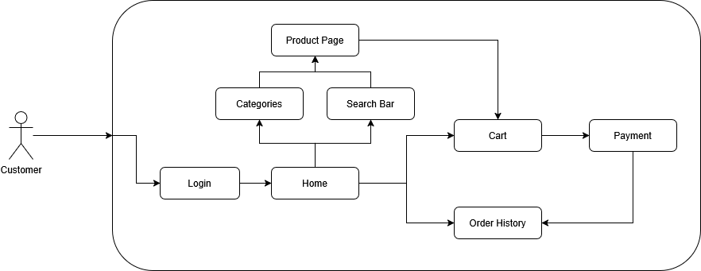

# 362FinalProject
This is a final project for CPSC 362 - Software Engineering

## Project was created by:
- Max Rivas
- Demi Chen
- Jacob Vasquez
- Marco Macias

Functional Requirements:
- Functioning Nav Bar
- Functioning Login and Signup feature
- Functioning Catalog Display
- Capable of Adding and Deleting Products at will
- Functioning shopping cart
- Order placing & tracking
- Functional Search Bar

Non-Functional Requirements:
- User friendly
- Contact and About Page
- Terms and Services Page
- Privacy Page
- Automated test cases with >90% coverage of backend

Requirement Modelling:

## How to Use:
1. In order to properly use this, you must first enter git clone the repo into your proper directory

2. Ensure Node.js is already installed, as you'll need npm

3. Run "npm install" on the respective directory, this will install all the necessary modules listed in the package.json

4. To run the application, simply enter "npm run dev" in the terminal, a message should pop up saying "Server is running on http://localhost:5500"

5. Either click [here](http://localhost:5500), or enter the full link provided to see the frontend

6. Use guest login if you cannot load the firebase (in environment file)

7. Run test cases by doing "npm test", covers all express backend routes

- The project utilizes node-persist for local storage of products
- Firebase for user login/signup

Possible Future Implementations:
- User cookies to save cart data per user
- User reviews
- Live hosting